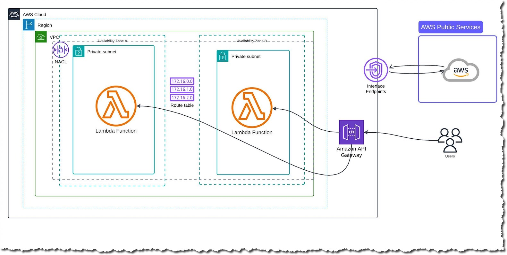
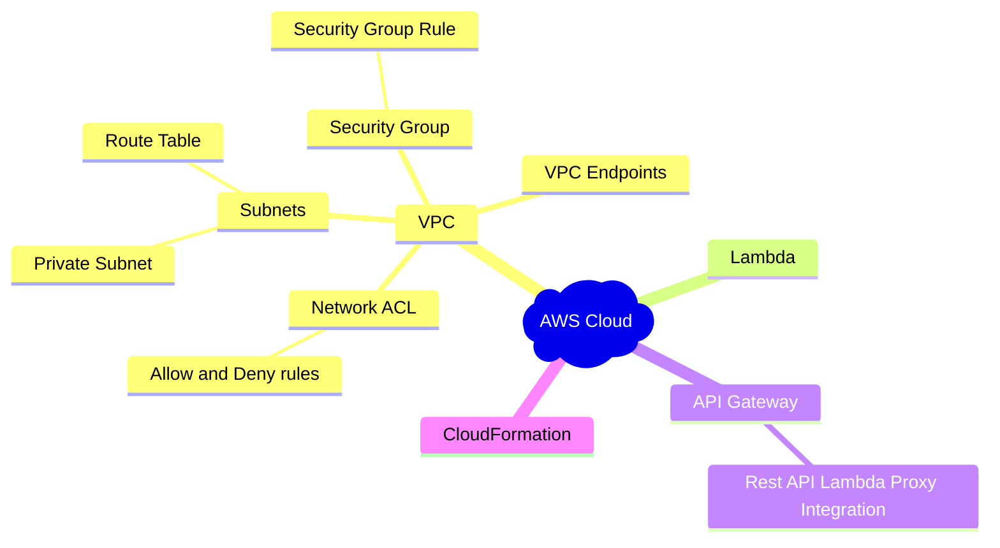
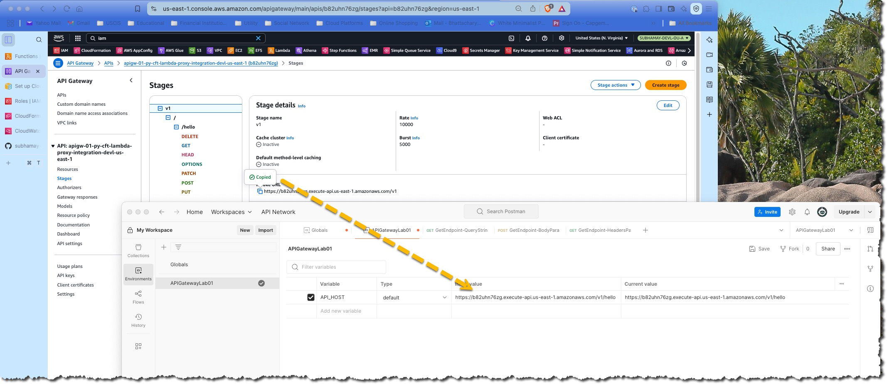
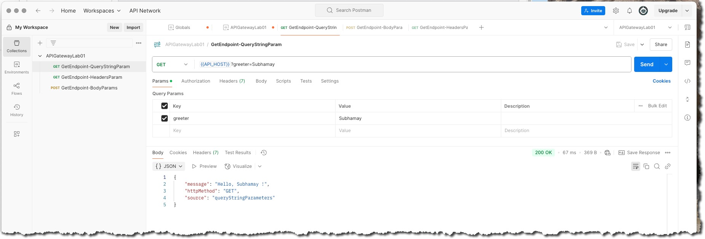
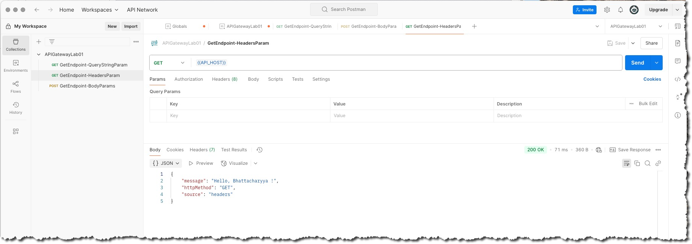
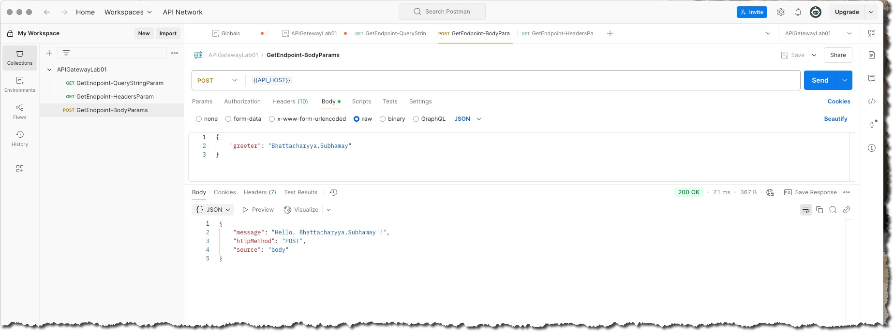
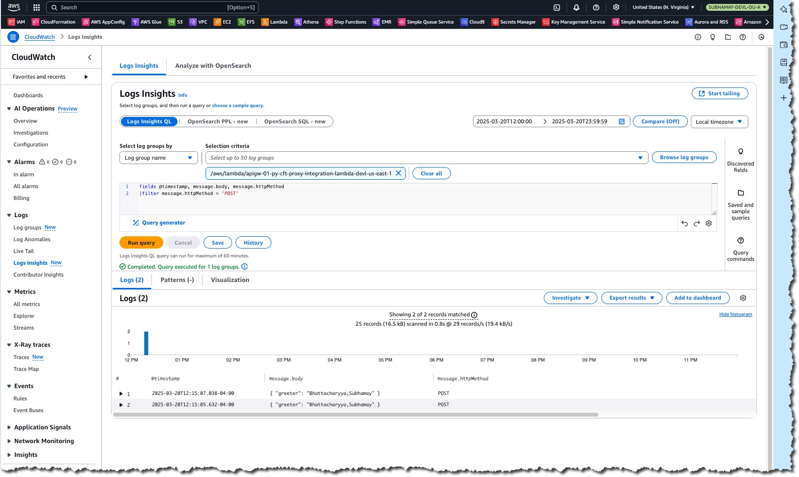

&nbsp;&nbsp;&nbsp;&nbsp;&nbsp;&nbsp;&nbsp;&nbsp;&nbsp;


---

## Table of Contents

- [About the Project](#about-the-project)
- [Architecture](#architecture)
  - [AWS Services Used](#aws-services-used)
  - [Overview](#overview)
  - [Architecture Components](#architecture-components)
    - [AWS Cloud Environment](#1-aws-cloud-environment)
    - [Virtual Private Cloud (VPC)](#2-virtual-private-cloud-vpc)
    - [Private Subnets](#3-private-subnets)
    - [Route Tables](#4-route-tables)
    - [AWS Lambda Functions](#5-aws-lambda-functions)
    - [API Gateway](#6-api-gateway)
    - [Interface Endpoints](#7-interface-endpoints)
    - [AWS Public Services](#8-aws-public-services)
    - [Users](#9-users)
    - [AWS Power Tools for Lambda](#10-aws-power-tools-for-lambda)
  - [Key Design Considerations](#key-design-considerations)
- [Prerequisites](#prerequisites)
- [Installation & Setup](#installation--setup)
  - [Clone the Repository](#1-clone-the-repository)
  - [Install Dependencies](#2-install-dependencies)
  - [Build the SAM Application](#3-build-the-sam-application)
  - [Deploy to AWS](#4-deploy-to-aws)
  - [Test the API Endpoint](#5-test-the-api-endpoint)
  - [Cleanup](#cleanup)
- [Contributing](#contributing)
  - [Code of Conduct](#code-of-conduct)
- [License](#license)
- [Contact](#contact)

---

## About the Project

This project demonstrates how to create a REST API using Amazon API Gateway with Lambda proxy integration. It uses AWS CloudFormation for Infrastructure as Code (IaC) and Python as the runtime for Lambda functions. The architecture is designed to be secure, scalable, and cost-efficient, making it ideal for serverless API deployments.

Key features include:
- **Serverless architecture** using AWS Lambda and API Gateway.
- **Private VPC** for enhanced security.
- **AWS Powertools for Lambda** to implement best practices like structured logging, tracing, and metrics.
- **Multi-AZ deployment** for high availability and fault tolerance.

## Architecture 🏗

Below is the architecture of the application:

- **Amazon API Gateway**: Handles HTTP requests and routes them to Lambda.
- **AWS Lambda (Python)**: Processes requests and returns responses.
- **AWS CloudFormation**: Deploys and manages the infrastructure as code.

 

### AWS Services Used



## Overview
This architecture illustrates a **serverless API deployment** using **AWS API Gateway, AWS Lambda, and a VPC with private subnets**.

## Architecture Components

### 1. AWS Cloud Environment
- The entire setup is hosted within an **AWS Cloud** region.

### 2. Virtual Private Cloud (VPC)
- A **VPC (Virtual Private Cloud)** is created to host private resources.
- **Network Access Control Lists (NACLs)** are configured for security.

### 3. Private Subnets
- Two **private subnets** are deployed in separate **Availability Zones (A and B)**.
- Each subnet hosts an **AWS Lambda function**, ensuring redundancy and high availability.

### 4. Route Tables
- The architecture uses private **route tables**.
- These subnets **do not** have direct internet access.

### 5. AWS Lambda Functions
- **Lambda functions are deployed inside private subnets.**
- They handle backend logic and process API requests.

### 6. API Gateway
- **Amazon API Gateway** is the public-facing endpoint for receiving HTTP requests.
- Routes incoming traffic to the appropriate AWS Lambda function.

### 7. Interface Endpoints
- **AWS Interface Endpoints** are used for private communication between AWS services.
- Allow Lambda functions to interact with AWS Public Services **without requiring an Internet Gateway or NAT Gateway**.

### 8. AWS Public Services
- Represents AWS-managed services that API Gateway or Lambda functions might access, such as:
  - Amazon S3
  - DynamoDB
  - Other AWS APIs

### 9. Users
- **End-users send HTTP requests to API Gateway**, which invokes the backend Lambda functions securely.

### 10. AWS Power Tools for Lambda

**AWS Powertools for AWS Lambda** is a suite of utilities that helps developers build serverless applications faster while following best practices. It provides features like structured logging, tracing, metrics, and various utilities to enhance AWS Lambda functions. AWS Powertools is available for **Python, Java, .NET, and TypeScript**.

## Key Design Considerations
- **Security:** Lambda functions reside in private subnets for restricted access.
- **Scalability:** API Gateway and Lambda automatically scale based on traffic.
- **Reliability:** Multi-AZ deployment ensures fault tolerance.
- **Cost Optimization:** Uses AWS Serverless services to reduce infrastructure costs.

## Conclusion
This architecture is ideal for **secure, scalable, and cost-efficient serverless API deployments** using AWS Lambda within a VPC.

---

## 🛠 Prerequisites

Before setting up the project, ensure you have:
- An AWS account

Ensure you have the following installed:
- **AWS CLI** ([Installation Guide](https://docs.aws.amazon.com/cli/latest/userguide/install-cliv2.html))
- **Python 3.x** ([Download](https://www.python.org/downloads/))
- Clone the repository **https://github.com/subhamay-bhattacharyya/aws-cfn-nested-stacks** and upload them to a S3 bucket in your AWS account. This repository contains the nested stack CloudFormation templates.
- Clone the repository **https://github.com/subhamay-bhattacharyya/0108-networking-cft.git** and use it to create a VPC with private only subnets.

---

## 🚀 Installation & Setup

Follow these steps to set up the project locally:

### 1. Clone the Repository
```sh
git clone https://github.com/subhamay-bhattacharyya/1111-api-gateway-py-cft.git
```

### 2. Create a Python virtual environmeny and install Dependencies
```sh
cd 1111-api-gateway-py-cft
cd lambda-code/src
python3 -m venv myenv
source myenv/bin/activate
pip install -r requirements.txt
mkdir package
cp -r myenv/lib/python3.x/site-packages/* package/
cd package && zip -r ../<lambda-function-base-name>.zip .
```

### 3. Upload the zip file to S3 bucket
- Use the S3 Bucket names (Code repository storing the zip file CloudFormation nested stack templates) as paremeters.

### 4. Deploy to AWS either using CLI or AWS CloudFormation console

Follow the prompts to provide the necessary configuration, such as stack name and AWS region.

### 5. Test the API Endpoint
Once deployed, retrieve the API Gateway URL from the output and test it using:
```sh
curl https://your-api-id.execute-api.your-region.amazonaws.com/<Stage Name>/
```

### 6. Use the Postman Collection for testing. 

After importing the Postman Collection and Environment, update the **API_HOST** environment variable with the API Endpoint.

 
 
 
 
### 7. Use log insights to query the CloudWatch logs.

 

## Cleanup
To delete the deployed resources either use AWS CloudFormation console or CLI


---

## Contributing

Contributions are what make the open-source community such an amazing place to learn, inspire, and create. Any contributions you make are **greatly appreciated**.

If you have a suggestion that would make this project better, please fork the repo and create a pull request. You can also simply open an issue with the tag "enhancement".
Don't forget to give the project a star! Thanks again!

1. Fork the Project
2. Create your Feature Branch (`git checkout -b feature/AmazingFeature`)
3. Commit your Changes (`git commit -m 'Add some AmazingFeature'`)
4. Push to the Branch (`git push origin feature/AmazingFeature`)
5. Open a Pull Request

##### Code of Conduct

Please note that this project is released with a [Contributor Code of Conduct](CODE_OF_CONDUCT.md). By participating in this project you agree to abide by its terms.

## License

Distributed under the MIT License. See `LICENSE` for more information.

## Contact

Subhamay Bhattacharyya
[ LinkedIn](https://www.linkedin.com/in/subhamay-bhattacharyya/)
[ GitHub](https://github.com/subhamay-bhattacharyya)
[](mailto:subhamay.aws@gmail.com)
Project Link: [https://github.com/subhamay-bhattacharyya/1111-api-gateway-py-cft](https://github.com/subhamay-bhattacharyya/1111-api-gateway-py-cft)